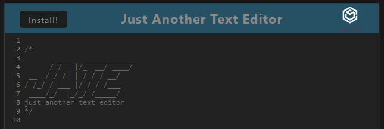

# open-scripting-site

## Description

open scripting site is just another text editor you can edit text and write scripts

## Installation

to install just go into the website and press install then ok the prompt    

## Usage

to use just open the site and start typing and it will automatically save if you click off or if you press the jate icon in the top left to use offline you can press the install button and approve the prompt that follows

## Links

website:https://open-scripting-site.herokuapp.com/
